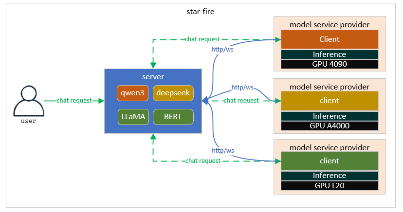
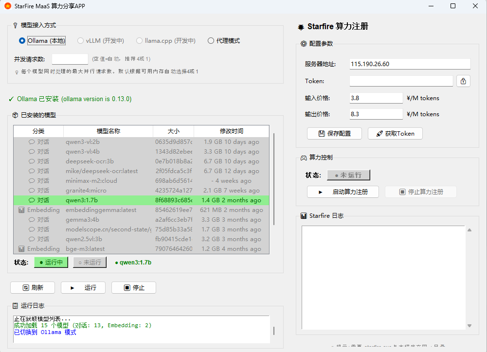

   <a href="./README.md">中文</a> | <strong>English</strong>

# Star Fire

MaaS-layer Personal Computing Power Service Platform

## Introduction

> [!NOTE]  
> This project allows you to share idle computing power (GPU) over the internet via MaaS, and earn API fee revenue from other users calling the shared models.
> [!IMPORTANT]
> - This project is for personal learning purposes only. Stability is not guaranteed, and no technical support is provided.
> - Users must comply with OpenAI's [Terms of Use](https://openai.com/policies/terms-of-use) and all **applicable laws and regulations**. Any illegal use is strictly prohibited.
> - In accordance with the [Interim Measures for the Management of Generative AI Services](http://www.cac.gov.cn/2023-07/13/c_1690898327029107.htm), do not provide unregistered generative AI services to the public in China.

## Architecture

## Key Features

Star-fire provides a rich set of features:

1. One-click connection of local LLMs to the star-fire cloud service, offering OpenAI API-compatible LLM APIs to all registered users
2. Automatic discovery and real-time registration of inference engines and models; supports proxy mode for forwarding model services
3. Model-level load balancing with streaming chat support
4. User login, registration, and token management
5. Token-based billing per user, model, and conversation
6. Multimodal model support (image-to-text)
7. Embedding model support
8. Model marketplace: users can browse and select their preferred models
9. Revenue statistics: users can view earnings from shared models
10. Usage statistics: users can track their own model usage
11. Tools/function calling support
12. Custom pricing (with min/max limits); currently supports unified custom pricing for all models, with platform-configurable client price bounds

## TODO

1. Support more inference engines: vllm, llama.cpp, sglang
2. Client-side per-model granular pricing
3. Model-price-based load balancing
4. Client-load-based load balancing
5. Real-time PC client revenue notifications
6. QoS support

## Supported Inference Engines

1. ollama
2. proxy (proxy mode)
3. llama.cpp (in development)
4. vllm (in development)

## Usage

Run `make install` to compile and install. After completion, you will find executables in the `build/server` and `build/client` directories.

### Server

1. Run with Go: `go run main.go` (default port 8080)
2. Build and run: `go build -o server main.go && ./server`
3. Build and run via Dockerfile

### User

1. Register and log in with your email address.

#### Sharing Models

**PC Client (macOS & Windows, GUI client, see releases):**

- Log in with username/password; models are automatically registered and discovered
- Customize model pricing in real time
- View real-time revenue
- Mixed inference engine support

**CLI Mode:**

1. Download the client or compile locally: `make client` (files are in `build/client`)
2. Go to the Model Marketplace page, click "Register to Star Fire", and obtain a registration token
3. Register the client:

    - **Windows:** `starfire.exe -host {host} -token {register token} -ippm {input prices per million tokens, default 4.0} -oppm {output prices per million tokens, default 8.0}`
    - **macOS:** `starfire -host {host} -token {register token} -ippm {input prices per million tokens, default 4.0} -oppm {output prices per million tokens, default 8.0}`

4. Run a model locally with ollama; the client will automatically push model info to the server and begin serving
5. Check the Revenue page to view earnings from all your shared models

#### Using Models

1. Browse and select a model on the Model Marketplace page
2. Go to the API Keys page to create and obtain an API key
3. Use `/v1/models` to list all available models
4. Use `/v1/chat/completions` for chatting
5. Check the Usage page to view your model usage details

### Demo

http://111.228.58.164/
