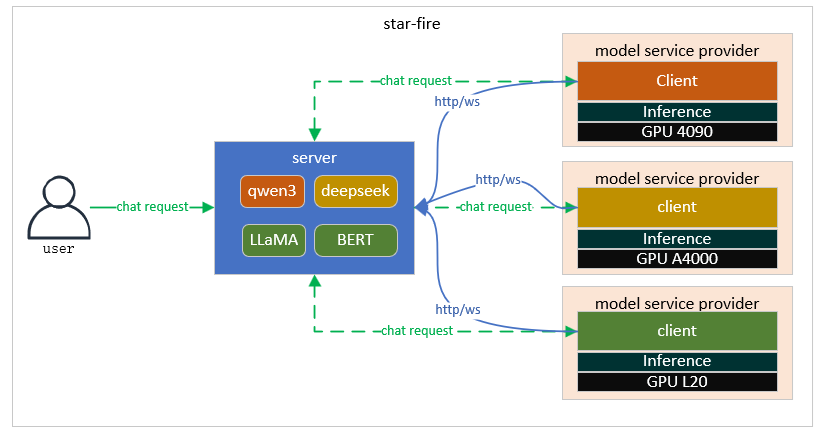

   <strong>中文</strong> | <a href="./README.en.md">English</a>

# Star Fire

MaaS层个人算力服务平台

## 项目说明

> [!NOTE]  
> 本项目为将闲置个人算力(GPU)通过MaaS方式进行共享，同时分享用户调用的API费用
> [!IMPORTANT]
> - 本项目仅供个人学习使用，不保证稳定性，且不提供任何技术支持。
> - 使用者必须在遵循 OpenAI 的[使用条款](https://openai.com/policies/terms-of-use)以及**法律法规**的情况下使用，不得用于非法用途。
> - 根据[《生成式人工智能服务管理暂行办法》](http://www.cac.gov.cn/2023-07/13/c_1690898327029107.htm)的要求，请勿对中国地区公众提供一切未经备案的生成式人工智能服务。

## 软件架构

## 主要特性

Star-fire提供了丰富的功能:

1. 本地大模型一键接入star-fire云服务，向所有注册用户提供openAI api标准的大模型API
2. 支持推理引擎、模型自动发现，实时注册
3. 支持按模型进行负载均衡，支持stream格式对话
4. 支持用户登录、注册、token管理
5. 支持按用户、模型对tokens进行统计

## inference支持
目前支持的推理引擎有：
1. ollama
2. vllm 

## 使用方法

### server端

1. go环境运行：go run main.go 
2. 编译后运行：go build -o server main.go & ./server
3. 使用dockerfile 进行build->run

### client端

主程序在client/cmd目录下

1. 登录用户:目前可使用curl方式进行测试用户登录，返回jwt
2. 使用jwt换取join token
3. 注册客户端 go ruan main.go -host localhost:8080 -engine all -token {join token}
4. 客户端用户 使用vllm或ollama运行模型，客户端会自动将模型信息推送到server端，并创建和server端的websocket链接

### 用户使用

1. 登录
2. 使用jwt换取 openai api的key
3. 使用 /v1/models 获取所有模型列表
4. 使用 /v1/chat/completions 对话

### 体验地址
http://1.94.239.51/
