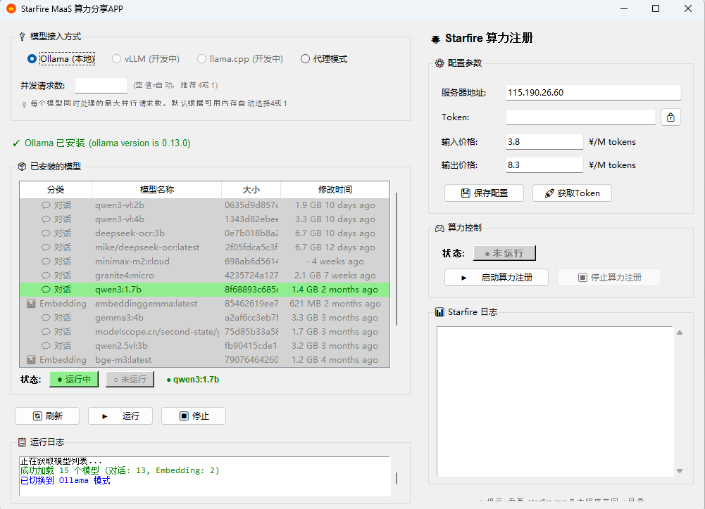

   <strong>中文</strong> | <a href="./README.en.md">English</a>

# Star Fire

MaaS层个人算力服务平台

## 项目说明

> [!NOTE]  
> 本项目为将闲置个人算力(GPU)通过MaaS方式进行共享，同时分享用户调用的API费用
> [!IMPORTANT]
> - 本项目仅供个人学习使用，不保证稳定性，且不提供任何技术支持。
> - 使用者必须在遵循 OpenAI 的[使用条款](https://openai.com/policies/terms-of-use)以及**法律法规**的情况下使用，不得用于非法用途。
> - 根据[《生成式人工智能服务管理暂行办法》](http://www.cac.gov.cn/2023-07/13/c_1690898327029107.htm)的要求，请勿对中国地区公众提供一切未经备案的生成式人工智能服务。

## 软件架构

## 主要特性

Star-fire提供了丰富的功能:

1. 本地大模型一键接入star-fire云服务，向所有注册用户提供openAI api标准的大模型API
2. 支持推理引擎、模型自动发现，实时注册
3. 支持按模型进行负载均衡，支持stream格式对话
4. 支持用户登录、注册、token管理
5. 支持按用户、模型、对话对tokens进行统计计费
6. 支持多模态模型(图生文)
7. 支持embedding模型
8. 支持模型广场，用户可以选择自己喜欢的模型进行使用
9. 支持收益统计，用户可以查看自己分享模型的收益情况
10. 支持用户使用统计，用户可以查看自己使用模型的情况
11. 支持tools调用
12. 支持自定义价格（上下限），目前只支持所有模型统一自定义价格，并且平台可设置客户端能设置的价格上下限

## TODO
1. 支持更多推理引擎 vllm、llama.cpp、sglang
2. 支持客户端按模型设置更细粒度的定价
3. 支持按模型价格进行负载均衡
4. 支持按客户端负载情况进行负载均衡
5. 支持收益的PC客户端实时提醒

## inference支持
目前支持的推理引擎有：
1. ollama
2. proxy(代理模式)
3. llama.cpp(开发中)
4. vllm(开发中)

## 使用方法

make install 进行编译安装，完成后，可在build目录下找到server和client下找到可执行文件

### server端

1. go环境运行：go run main.go （默认端口8080）
2. 编译后运行：go build -o server main.go & ./server
3. 使用dockerfile 进行build->run

### user端

1. 使用邮箱注册并登录

#### 分享模型
1. PC客户端模式（目前支持mac和windows，图形客户端，见release）

2. 命令行模式

   (1) 下载客户端，或本地编译 make client （build/client目录下）

   (2) 在模型广场页面点击注册到Star Fire 获取注册token

   (3) 注册客户端： 

       （windows）starfire.exe -host (host) -token {register token} -ippm {input prices per million tokens, default 4.0} -oppm {output prices per million tokens, default 8.0}

       （macos）： starfire -host {host} -token {register token} -ippm {input prices per million tokens, default 4.0} -oppm {output prices per million tokens, default 8.0} 

   (4) 本地使用ollama 运行模型，客户端会自动将模型信息推送到server端，准备提供服务 

   (5) 可以在我的收益页面查看自己所有提供模型的收益情况

#### 使用模型
1. 在模型广场页面选择模型
2. 在API密钥页面创建获取API密钥 
3. 使用 /v1/models 获取所有模型列表
4. 使用 /v1/chat/completions 对话
5. 可以在我的使用页面查看自己使用模型的情况

### 体验地址
http://115.190.26.60/
