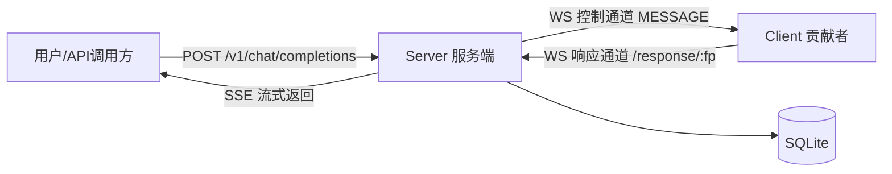

# Star-Fire 架构与并发能力分析

> 分析日期：2026-08-14
> 范围：`internal/`、`client/internal/`、`routes/`、`middleware/`、`config/`、`pkg/public/`、部署配置

## 1. 总体架构

Star-Fire 是一个「算力共享」平台：贡献者在自己电脑上运行推理引擎（Ollama / vLLM / OpenAI 代理），通过 WebSocket 把算力注册到中心服务器；用户用 OpenAI 兼容 API 调用 `/v1/chat/completions`，服务器负责路由、转发、计费、分成。

**关键点**：每个请求有两条 WebSocket 通道——
- **控制通道**（client→server 长连接，`/register/:id`）：客户端注册后常驻，服务端靠它下发请求。
- **响应通道**（client→server，每请求一条，`/response/:fingerprint`）：客户端拿到请求后主动反向拨号回服务端，把 token 流回来。

这解决了贡献者在 NAT 后无法被主动连接的难题（client 全程只做出站连接）。

## 2. Chat → Client 完整链路

以 `POST /v1/chat/completions` 为例（`routes/routes.go` → `service/chat.go`）：

1. **鉴权** `middleware.AuthRequired`：先试 JWT，失败再试 API Key，把 `user_id` / `api_key_id` 放进 gin context。
2. **`HandleChatRequest`**：
   - `ShouldBindJSON` 绑定 `ExtendedChatRequest`（标准请求 + `thinking`/`enable_thinking` 扩展字段）。
   - 只在用户没显式传 `reasoning_effort` 时补默认值（qwen 系给 `low`，避免 vLLM/GLM-5.1 输出混乱）。
   - **余额预检查**：`GetBalance <= 0` 直接返回 402 `insufficient_quota`（OpenAI 兼容格式）。
3. **`handleChatWithRetry`**（核心，最多重试 3 次 `MAX_CHAT_RETRY`）：
   - `LoadBalanceExcluding(model, userID, failedClients)` 选 client（排除已失败节点）。
   - 从该 client 的 `Models` 里取出 `IPPM/OPPM/CIPPM` 计费价。
   - `uuid.NewString()` 生成 fingerprint，`SaveFingerprint(status="preparing")`。
   - 向 `client.ControlConn` 写 `MESSAGE`（带请求体和 fingerprint）。
   - **等响应就绪**：`AddRespClientChan(fp)` 注册 channel，客户端拨号 `/response/:fp` 时 `NotifyRespClientReady` 关闭它（避免自旋等待）。
   - `GetRespClient(fp)` 拿到响应连接，`UpdateFingerprint("transmitting")`。
   - `ReadJSON` 读第一条消息，按类型分发。
4. **客户端** `client/internal/client/controller.go`：
   - `handleChatMessage`：为每个 fingerprint 建可取消 context（存进 `requestCancels sync.Map`，用于 abort）。
   - `findEngineForModel` 找到对应引擎，`openResponseConn` 反向拨号 `/response/:fp`，`engine.HandleChat(ctx, ...)` 把 token 写回响应连接。
5. **回流 + 计费**：服务端 `handleStreamChatResponse` 把每个 stream 块写成 SSE `data: {...}\n\n`；收到 `usage` 块后 `recordTokenUsage`：算 cost、`DeductBalance`、`SaveTokenUsage`，然后发 `[DONE]` 关闭。

**重试语义**：只在「读到第一个 token 之前」重试——一旦有 `MESSAGE`/`MESSAGE_STREAM` 就进入正常流程不再重试，因为用户可能已收到内容。失败时 `abortClientRequest` 发 `CLOSE`+`ABORT` 通知 client 取消该 fingerprint 的推理，避免算力浪费。

## 3. 负载均衡

位于 `internal/models/server.go`，是一条 **Predicate → Pick** 流水线：

- **Predicate 阶段**：`clientHealthy`（`online` && `ControlConn!=nil` && 延迟 < 30s）+ `priceEligible`（用户 price cap 内）。健康检查顺带识别死节点后台清理。
- **Pick 阶段**，三种算法（`LBA` 环境变量，默认 `round-robin`）：
  - `round-robin`：按 ID 排序保证确定性，`clientRBMu` 锁 + per-model 索引。
  - `random`：`rand.Intn`。
  - `min-conn`：查 `ClientFingerprintDB.GetClientChatConnections` 统计每个 client 正在 `transmitting` 的连接数，选空闲最多的（ollama 用 `NumParallel` 算 idle）。

⚠️ **两处不一致（bug）**：
- `.env.example` 注释写 `least-connections`，但代码 `pick()` 匹配的是 `min-conn`，配 `LBA=least-connections` 会落到 default 分支返回 `nil`，导致所有 chat 请求失败。要用必须配 `min-conn`。
- `embedding` 走独立 `LoadBalanceEmbedding`，内部**写死 `rand.Intn` 随机选择**，不走配置的 LB 算法。

## 4. 数据库

- **GORM + `github.com/glebarez/sqlite`**（纯 Go SQLite，无 CGO，配合 Dockerfile `CGO_ENABLED=0`）。单文件 `./data/star_fire.db`。
- 启动 PRAGMA：`journal_mode=WAL`、`busy_timeout=5000`、`synchronous=NORMAL`、`cache_size=-20000`（约 20MB）、`foreign_keys=ON`。
- 连接池：`SetMaxIdleConns(10)`、**`SetMaxOpenConns(4)`**、`SetConnMaxLifetime(1h)`。
- 表（AutoMigrate）：`users`、`api_keys`、`clients`、`client_fingerprints`、`token_usages`、`model_prices`、`trends`、`recharges`、`user_price_caps`；注册 token 是**内存态** `RegisterTokenStore`（`sync.Map` + 定时清理）。
- `token_usages` 热表建了 4 个复合索引：`(user_id,timestamp)`、`(client_id,timestamp)`、`(user_id,model,timestamp)`、`(client_id,model,timestamp)`。

**每个 chat 请求约 8~10 条 SQL**：鉴权 1~2、`GetBalance` 1、`SaveFingerprint` 1、`UpdateFingerprint` 2（FirstOrCreate + Update）、`DeductBalance` 2（SELECT + UPDATE）、`SaveTokenUsage` 1，`min-conn` 再加 1 条聚合。

## 5. 锁 / 并发机制

服务端用「写时复制 + 原子快照」组合：

| 数据结构 | 锁 | 用途 |
|---|---|---|
| `clients`（`map[model]map[id]*Client`） | `atomic.Value` + `clientsMu` | 读走 `Load()` 无锁快照，写走 copy-on-write |
| `clientRoundRobinIndex` | `clientRBMu sync.RWMutex` | RR 索引 |
| `RespClients`（fingerprint→conn） | `respClientsMu sync.RWMutex` | 响应连接表 |
| `respClientReadyChans` | `respClientReadyChansMu` | 就绪通知 channel |
| `Client.ControlConnMutex` | `sync.Mutex` | 控制通道写串行化 |
| `Client.LatencyMutex` | `sync.RWMutex` | 延迟读写 |

客户端侧：`wsMu`（控制连接写）、`modelsMu`、`enginesMu`、`lifecycleMu`、`routingMu`、`requestCancels sync.Map`。

**并发风险**：
1. `DeductBalance` 非原子（`internal/models/user.go`）：先读余额再写回，并发同一用户会重复扣/超额扣。应改原子 SQL：`UPDATE users SET balance = balance - ? WHERE id = ? AND balance >= ?`。
2. INCOME 通知并发写（`recordTokenUsage`）：`conn := ControlConn` 锁内拷贝、锁外 goroutine 里 `conn.WriteJSON`，与 keepalive goroutine 写同一连接会触发 gorilla/websocket panic「concurrent write」。
3. `handleEmbeddingResponse` 数据竞争：直接无锁读 `server.RespClients[fp]`，且 1ms 忙轮询（chat 已改 channel，embedding 仍是旧自旋）。
4. `PongChan` 无缓冲：`handleKeepAliveMessage` 阻塞发送，若 keepalive goroutine 已退出，`handleClientMessages` 永久卡住。

## 6. 大概能支撑多大 chat API 并发？

**结论：瓶颈不在 CPU，而在「SQLite 4 连接」+「WebSocket 每连接 2MB 缓冲」+「客户端真实推理吞吐」。**

**① 内存（并发流数量硬上限）**
`internal/websocket/connection.go` 把 `ReadBufferSize` / `WriteBufferSize` 硬编码 **1MB**（`WS_BUFFER=1048576` 配置项未生效）。每个贡献者控制连接 = 2MB，每个在途 chat 响应连接 = 服务端 2MB。并发流线性吃内存：**1GB ≈ 500 条并发流，8GB ≈ 4000 条**。

**② SQLite 吞吐（新请求速率上限）**
`MaxOpenConns=4` + 每请求 8~10 条 SQL（写密集）。WAL + `synchronous=NORMAL` 下 SQLite 单机约几百到 ~2000 简单写/秒，对应**每秒几百到一千出头新请求**。

**③ CPU**
服务端是「JSON 编解码 + SSE 转发」的 IO 密集型，gin + goroutine 处理几千并发流无压力。4~8 核够用，再加核收益递减。

**综合评估**：一台 4 核 / 8GB 主机，当前 SQLite 配置下，**舒服运行几百条并发 chat 流，冲到 1000~2000 并发时延迟明显劣化**（SQLite 写争用 + 2MB/连接内存双杀）。真实 token 生成吞吐最终由各客户端 GPU/`NumParallel` 决定，服务器只是中转。

## 7. 数据库能换 PG / MySQL 吗？

能，且这是最值得做的扩展。GORM 已抽象驱动，改动点：

1. **换驱动**：`go.mod` 加 `gorm.io/driver/postgres`（pgx，纯 Go）或 `gorm.io/driver/mysql`，`NewServer()` 里 `gorm.Open` 换成对应 `Open`。
2. **删 SQLite 专属代码**：
   - `NewServer()` 的 `PRAGMA` 循环（PG/MySQL 会报错）改成条件判断或移除。
   - `GetMaxUserID` 用了 `CAST(id AS UNSIGNED)`（MySQL 语法），换 PG 要改。
   - `CREATE INDEX IF NOT EXISTS`：PG 支持，**MySQL 8 不支持**（改成先判断再建）。
3. **`User.ID string + autoIncrement` 是个坑**：string 主键 autoIncrement 在 SQLite 靠 rowid 能用，PG/MySQL 不会自动生成。当前靠 `InitDefaultUsers` 硬写 `"1"`/`"2"` + `GetMaxUserID` 取最大。**迁移前建议改成 `uint` 自增或 UUID**。
4. **连接池**：`MaxOpenConns=4` 要放开，PG/MySQL 通常 50~200。
5. **迁移数据**：`AutoMigrate` 建表 + 工具（`pgloader` / 自写脚本）导数据。`models` 列是 JSON 字符串，PG 可用 `jsonb` 但 GORM 默认 `text`。

> 注：`client` 用纯 Go `modernc.org/sqlite`，`pgx`/`go-sql-driver/mysql` 也是纯 Go，`CGO_ENABLED=0` 的 Docker 构建不受影响。

## 8. 扩容 / 建议优先级

1. **SQLite → PostgreSQL/MySQL**（`MaxOpenConns` 提到 50+）——解除最大单点写瓶颈。
2. **降低 WS 缓冲**：`connection.go` 硬编码 1MB 改成 4~16KB，并让 `WS_BUFFER` 真正生效，并发流内存降 100~250 倍。
3. **`DeductBalance` 改原子扣减**，防止并发超额消费（资金安全）。
4. **修 `recordTokenUsage` 并发写**（INCOME 通知在 mutex 内写）。
5. **修 `.env.example` 的 `least-connections` → `min-conn`**，并把 embedding 的 LB 接入配置。
6. **CPU 加到 4~8 核即可**；**内存才是并发流线性瓶颈**，按 2MB/流（改小缓冲后更低）规划。

## 9. 附带发现（影响部署）

- **`dockerfile` 构建路径写错**：`go build ... ./cmd/server`，但服务端入口是根目录 `main.go`（根目录无 `cmd/server`，只有 `client/cmd`），Docker 构建会失败。应改成 `go build ... -o server .`（`Makefile` 的 `SERVER_SRC = ./` 是对的）。
- `MAX_LATENCY` / `WS_BUFFER` 配置加载了但**未使用**，健康检查实际用 `public.MAXLATENCE = 30000`（毫秒，即 30 秒），比配置默认的 5 秒宽松得多。
