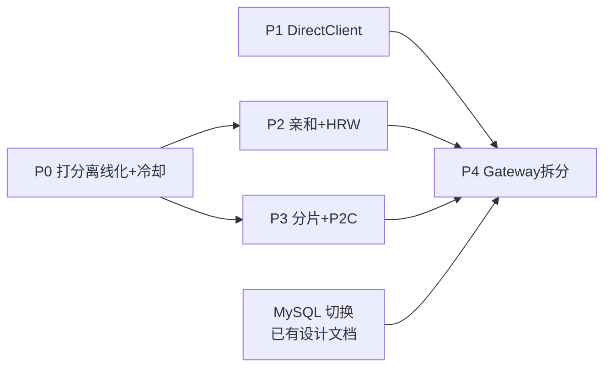

# Star-Fire 规模化负载均衡与路由架构演进设计（P0–P4）

> 状态：设计稿（未实施）。**实施规格已拆分**：[impl/p0-score-offline-cooldown.md](impl/p0-score-offline-cooldown.md)、[impl/p1-direct-backend.md](impl/p1-direct-backend.md)、[impl/p2-affinity-cache.md](impl/p2-affinity-cache.md)（含代码级改动、单测清单、集成测试步骤，以实施规格为准）
> 前置讨论：`docs/loadbalance.html`（DeepSeek 分享的网关路由方案）、`docs/load-balance-algorithm.md`、`docs/lb_saturation_test.py` 仿真
> 目标场景：贡献者 client 规模从百级 → 万级 → 百万级；引入固定后端（OpenRouter 式，固定 IP/URL）作为默认稳定供给，个人贡献者以低价竞争流量；要求高并发、高稳定、可水平扩展、KV cache 亲和、防抖动。
> 构建理念：**消费者服务稳定 + 个人算力通过模型汇聚**，两者靠市场信号统一——同模型 Direct 默认优先保证稳定，消费者可按价格/容忍度（延迟、抖动）自主调节路由偏好，低价众包供给由大批量价格敏感用户用钱投票选中；无 Direct 供给时自动退化为纯众包（即现状）。

---

## 0. 现状与瓶颈总览

### 0.1 现有架构关键事实

| 组件 | 位置 | 现状 |
|---|---|---|
| 路由入口 | `internal/service/chat.go` `handleChatWithRetry` | 首 token 前同步重试 ≤ `MAX_CHAT_RETRY`(3) 次，每次重新 `LoadBalanceExcluding` |
| 过滤 | `internal/models/server.go` `LoadBalanceExcluding` | Predicate 链：`clientHealthy` → `priceEligible` → `connectionLimitEligible` |
| 选择 | `pickSmart`（两阶段） | Stage1 全量 `perfScore` 打分排序取 Top-N（N=`LBCandidateCount`=3）；Stage2 会员权重(1/3/8)加权随机 |
| 打分 | `perfScore` | 6 维：cap/lat/fail/stab/serv/bw = 0.20/0.20/0.15/0.10/0.10/0.25 |
| 注册表 | `Server.clients atomic.Value` | copy-on-write：`RegisterModel`/`RemoveClient` 全量 `copyClientsMap` |
| 连接 | `Client.ControlConn`（WS） + 每请求 RespConn（WS） | 全部驻留单进程内存 |
| 延迟 | `Client.SetLatency` | 已有 EMA 平滑（alpha 平滑存 `LatencyEMA`） |
| 限流 | `internal/models/rate_limit.go` `RateLimiter` | 内存令牌桶（RPM/TPM），单进程 |
| 计费 | `recordTokenUsage` | 同步 `DeductBalance` + `SaveTokenUsage`；已含 `cached_tokens`/CIPPM |
| 请求追踪 | `ClientFingerprintDB` | 每次请求/重试写 DB（preparing→transmitting→completed） |

### 0.2 瓶颈按爆掉顺序排列

1. **`perfScore` 热路径 DB 查询**（千级即爆）：每个 eligible client 每请求 2 次 DB 查询（`ClientStatsDB.GetStats` + `TokenUsageDB.GetIncomeTokenUsage` 聚合扫描）。1000 个同模型 client ⇒ 每请求 2000 次查询。
2. **copy-on-write 全量复制**（高 churn 爆）：O(N × churn/s)。百万 client × 100 churn/s = 每秒亿级 entry 复制。
3. **全量遍历+排序**（十万级爆）：每请求 O(N) Predicate + O(N log N) 排序。
4. **单进程 WS 容量**（十万连接后需多节点）：每 client 1 条 control WS + 每请求 1 条 resp WS，goroutine/FD 上限。
5. **心跳风暴**（百万级）：keepAlive 消息解析 + 潜在落库。
6. **内存态不可共享**：`clients`/`RespClients`/`RateLimiter`/`reasoning` 全内存 ⇒ 无法多副本。

### 0.3 阶段总览

| 阶段 | 主题 | 解决瓶颈 | 依赖 | 规模上限（估） |
|---|---|---|---|---|
| P0 | 打分离线化 + 熔断冷却 | 瓶颈1 + 抖动 | 无 | ~5 千 client |
| P1 | DirectClient 固定后端 + 偏好双池路由 | 主力供给、水平扩展基础、市场化分流 | 无（可与 P0 并行） | 主力池无上限 |
| P2 | 会话亲和 + 租约回迁 + HRW | KV cache 命中、防抖 | P0（推荐先做） | 同 P0/P1 |
| P3 | 注册表分片 + P2C + 心跳降频 | 瓶颈2/3/5 | P0 | ~50 万众包 client（单机连接内存允许下） |
| P4 | Conn-Gateway 拆分 + 状态外置 Redis | 瓶颈4/6 | P1、P3 | 百万级、多节点 |

各阶段独立可交付、可验收、可回滚。P0/P1/P2 不改 WS 协议、不引入新外部依赖（P2 亲和表接口化，先内存实现）。

---

## P0 打分离线化 + 失败熔断冷却

### P0.1 目标

- 路由热路径零 DB 查询：`pickSmart` 只读内存缓存分。
- 失败 client 有冷却隔离期，消除"失败→下一请求又被选中"的抖动。
- 行为对齐现状：打分公式、权重、两阶段选择逻辑不变，只改数据来源与失败处理。

### P0.2 设计

#### A. 缓存分（CachedScore）

`Client` 新增字段（`internal/models/client.go`，全部 `gorm:"-"`）：

```go
// perfScore 的离线缓存与其慢变输入（后台刷新协程维护）
CachedStabilityScore uint64 // math.Float64bits 存储，原子读写
CachedServiceScore   uint64 // 同上
ScoreUpdatedAt       int64  // unix 秒，原子
```

拆分原则：**快变维度留在热路径实时算，慢变维度离线算**。
- 快变（内存原子读，零成本）：`capacityScore`（ActiveConnections）、`latencyScore`（LatencyEMA）、`failureScore`（RecentFailures）、`bandwidthScore`（BandwidthMbps）。
- 慢变（DB 来源，离线刷）：`stabilityScore`（ClientStats）、`serviceScore`（TokenUsage 聚合）。

`perfScore` 改为：

```go
func (s *Server) perfScore(c *Client) float64 {
    // cap/lat/fail/bw：实时内存读（与现状相同的公式）
    // stab/serv：atomic 读 CachedXxxScore，未初始化(=0 且 ScoreUpdatedAt==0)时用 0.5 中性值
}
```

> 用 0.5 中性值而非 0：避免新 client（无历史）在 stab/serv 两维被判死刑，缓解马太效应。

#### B. 后台刷新协程（ScoreRefresher）

`NewServer` 中启动（与现有 1h ticker 并列，独立 ticker）：

- 周期：`SCORE_REFRESH_INTERVAL`（默认 30s，env 可配）。
- 每轮：遍历在线 client 列表（快照读），**批量**查询：
  - `ClientStats`：一次 `WHERE client_id IN (...)` 批量拉取（`ClientStatsDB` 新增 `GetStatsBatch(ids []string)`）。
  - token 聚合：一次 `GROUP BY client_id` 聚合查询近 N 天贡献（`TokenUsageDB` 新增 `GetTotalTokensByClientIDs(ids, since)`），替代现有逐 client 的 `GetIncomeTokenUsage` 全扫。
- 算出 stab/serv 分后 `atomic.StoreUint64(&c.CachedXxxScore, math.Float64bits(v))`。
- 单轮全程失败仅打日志，不影响路由（旧缓存分继续用）。

#### C. 熔断冷却（cooldown）

`Client` 新增：

```go
CooldownUntil int64 // unix 纳秒，原子；0=无冷却
```

规则：
- 触发点：集成在 `IncrFailures()`/`ResetFailures()` 方法本体（开关门控），调用点零改动。注：`IncrFailures` 调用点实际只在 `chat.go`（8 处）与 `format_adapter.go`（8 处），**embedding.go 没有**（实施规格已核实修正）。
- 冷却时长：`base × 2^(RecentFailures-1)`，base=`LB_COOLDOWN_BASE_MS`（默认 5000ms），上限 `LB_COOLDOWN_MAX_MS`（默认 300000ms=5min）。
- `isClientRequestError` 为 true 的 4xx 路径**不触发**冷却（与现状不标记失败一致）。
- 过滤点：`clientHealthy` 开头增加 `if c.InCooldown() { return false }`——注意放在 Predicate 里而非删除 client，冷却结束自动恢复。
- 恢复：`ResetFailures()` 同时清零 `CooldownUntil`（成功即完全恢复）；无需半开态——冷却结束后首个请求天然就是探测（失败则以更长冷却再次隔离）。

#### D. 延迟去毛刺说明

`SetLatency` 已有 EMA（`LatencyEMA`），单次尖峰已被平滑，**本阶段不改**。仅将 `clientHealthy` 的判定注释补充说明依赖 EMA 值。若后续观测仍有误踢，再引入"连续 K 次超标才剔除"。

### P0.3 改动文件清单

| 文件 | 改动 |
|---|---|
| `internal/models/client.go` | Client 新增 3+1 字段 + `TripCooldown`/`InCooldown`/`SetCachedScores` 等方法 |
| `internal/models/server.go` | `perfScore` 改读缓存；`clientHealthy` 加冷却检查；`NewServer` 启动 ScoreRefresher |
| `internal/models/client_stats.go` | 新增 `GetStatsBatch` |
| `internal/models/token_usage.go` | 新增 `GetTotalTokensByClientIDs`（GROUP BY 聚合） |
| `internal/service/chat.go` | `IncrFailures` 后追加 `TripCooldown`（4 处） |
| `internal/service/embedding.go` | 同上 |
| `internal/service/format_adapter.go` | 同上 |
| `config/config.go` | `ScoreRefreshInterval`/`LBCooldownBaseMs`/`LBCooldownMaxMs` |

### P0.4 验收与测试

- 单测：`server_smart_test.go` 补 `TestPerfScoreUsesCachedSlowDims`（不接 DB 时 stab/serv=0.5 中性值）、`TestCooldownFilter`（冷却中被过滤、到期恢复、成功清零）、`TestCooldownExponential`。
- 压测对比：`docs/lb_saturation_test.py` 仿真加入 cooldown 模型，确认失败节点的重复选中次数下降。
- 线上指标：路由期间 DB 查询数应降为 0（可临时在 GetStats/GetIncomeTokenUsage 加计数日志验证）。
- 回滚：所有新逻辑由 env 开关 `LB_SCORE_OFFLINE=true`/`LB_COOLDOWN_ENABLED=true` 控制，关掉即回到现行为。

---

## P1 DirectClient 固定后端 + 双池路由

### P1.1 目标

- 支持 OpenRouter 式固定后端（固定 IP/URL + API Key，HTTP 直连），作为默认稳定供给。
- 固定后端**不走 WS 隧道**：无 fingerprint 等待、无 RespConn、无连接归属问题，任何 server 副本都可直接调用 ⇒ 主力流量天然可水平扩展。
- 路由策略：默认（`stability`）主力池优先，饱和/失败溢出到众包池；消费者可通过**路由偏好**（P1.3A）选择价格优先——低价众包承接大批量价格敏感流量（跑批/蒸馏/离线任务恰是 token 大户），贡献者的量由用户用钱投票形成，而非平台配额。

### P1.2 数据模型

新文件 `internal/models/direct_backend.go`：

```go
// DirectBackend 固定后端（平台直连的模型供给，如自建 vLLM 集群 / 合作方 API）
type DirectBackend struct {
    ID        string `gorm:"primaryKey;size:64"`
    Name      string `gorm:"size:128"`
    BaseURL   string `gorm:"size:256"`   // e.g. https://vllm-1.internal:8000/v1
    APIKey    string `gorm:"size:256"`   // 出站鉴权（存储需加密或至少标注敏感）
    Format    string `gorm:"size:32"`    // openai|anthropic|responses，对齐 UpstreamFormat
    Enabled   bool
    MaxConns  int    // 硬并发上限
    Priority  int    // 同模型多后端时的优先级（越小越优先）
    // 计费价格（平台成本价/结算价）
    ModelsJSON string `gorm:"type:text"` // []public.Model（复用现有结构：Name/IPPM/OPPM/CIPPM）
    // 运行态（内存，gorm:"-"）
    ActiveConns   int32   `gorm:"-"`
    RecentFailures int32  `gorm:"-"`
    CooldownUntil  int64  `gorm:"-"`
    LatencyEMA     float64 `gorm:"-"`
}
```

管理方式：DB 表 + `starfire` CLI 子命令（`add-backend`/`list-backends`/`enable-backend`），启动时载入内存注册表 `Server.directBackends`（`map[model][]*DirectBackend`，读多写少用 `sync.RWMutex`）。健康检查协程每 30s 调 `GET {BaseURL}/models` 探活 + 记录延迟 EMA。

### P1.3 路由整合

`handleChatWithRetry` 第 1 步改为两级，池顺序由**路由偏好**决定（默认 `stability`）：

```
attempt 循环内（stability，默认）：
  1a. pickDirect(model, failedIDs)  // 主力池：按 Priority → 负载率 → 延迟选
      命中 → 走 HTTP 直连路径（见 P1.4），成功即 return
  1b. LoadBalanceExcluding(...)     // 众包池：现有逻辑不动
```

- 主力池选择规则（池内数量少，几个到几十个，无需复杂算法）：过滤（Enabled、非冷却、`ActiveConns < MaxConns`、模型匹配、价格帽）→ 按 `Priority` 分层 → 同层选 `ActiveConns/MaxConns` 最低者。
- 失败处理与众包一致：失败计数 + 冷却 + 加入 `failedIDs` 排除集，溢出到 1b。
- 开关：`DIRECT_BACKENDS_ENABLED`（默认 false，不影响现网）。

#### A. 路由偏好（RoutingPreference）

消费者按价格与容忍度自主选池，平台不做固定配比分流。偏好来源：API Key 级设置（`api_key.go` 加 `Routing` 字段，可后置）+ 请求级覆盖（body `routing` 字段 / `X-SF-Routing` header，请求级优先）。

| 偏好 | 语义 | 池顺序 |
|---|---|---|
| `stability`（默认） | 稳定优先 | 1a Direct → 1b 众包溢出（上述现设计） |
| `cost` | 价格优先 | 两池合并按**有效单价**升序（= `IPPM×(1−h) + CIPPM×h`，h 为 CacheHitEMA，见 P2.6）取最低价层，层内按 perfScore；失败溢出至次价层 |
| `balanced` | 折中 | 众包中 perfScore ≥ `LB_BALANCED_MIN_SCORE` 者优先，不足/失败溢出 Direct |

- **溢出计费规则**：`cost` 模式失败溢出到更贵供给时，目标仍必须过 `priceEligible`（用户价格帽）；过不了返回 503——用户选便宜即接受"便宜但可能失败"的契约，绝不悄悄按贵价计费。

#### B. 容忍度参数

Predicate 链新增两个可选谓词（请求级/Key 级，缺省不启用=现行为）：

- `max_latency_ms`：过滤 `LatencyEMA` 超标的 client/backend（收紧=只要快的，放宽=便宜就行）；
- `min_stability`：stab 分（P0 缓存分）门槛，过滤在线稳定性差的众包 client。

#### C. 价格前提与无 Direct 退化

- 两池须有真实价差市场机制才生效：Direct 价 = 平台成本 + SLA 溢价（`ModelsJSON` 配置）；众包价 = 贡献者自定价（现有机制）。
- 某模型无 Direct 供给（冷启动期/冷门模型）：`pickDirect` 返回空 → 直接落 1b，各偏好自动退化为现行为，无需特殊逻辑；稳定性由 P0 冷却 + 重试 + P2 亲和承担（即现网今天的运行方式）。Direct 按模型逐个点亮，`map[model][]*DirectBackend` 天然支持局部覆盖。
- 模型列表 API 暴露 `tiers: ["direct","community"]`，对外 SLA 按**供给类型**标注，而非按偏好承诺（选了 `stability` 但该模型只有众包时是"尽力而为的稳"）。

### P1.4 HTTP 直连执行路径

新文件 `internal/service/direct_chat.go`：

- 复用 client 端 `client/internal/inference/openai/engine.go` 的既有模式（raw JSON 转发 + SSE 逐行读）但在 server 进程内实现：
  - 非流式：POST `{BaseURL}/chat/completions` → 解析 → `c.JSON` → `recordTokenUsage`（clientID 用 `"direct:"+backend.ID`）。
  - 流式：SSE 逐行读 → 原样写 `c.Writer`（`data: ...\n\n`）→ 尾部 usage 块触发 `recordTokenUsage` → `[DONE]`。
- 复用 `isClientRequestError` 判定 4xx 直接回传不重试。
- 多格式（`/v1/messages`、`/v1/responses`）：`format_adapter.go` 的 `clientUpstreamFormat` 处按 backend.Format 走 `BuildUpstreamRequest`，转发逻辑同上。首期可只支持 openai 格式后端，anthropic/responses 后端放 P1.5 增量。

### P1.5 计费与收益

- `TokenUsage.ClientID = "direct:"+backend.ID`，用户侧计费公式不变（价格取 backend 的 ModelsJSON）。
- 收益归属：固定后端无"贡献者收益"概念，`recordTokenUsage` 中 `GetClientByModel` 查不到即跳过 INCOME 推送（现有 nil 分支已兜住，仅需确认日志级别不刷屏）。

### P1.6 改动文件清单

| 文件 | 改动 |
|---|---|
| `internal/models/direct_backend.go` | 新增：模型 + DirectBackendDB + 内存注册表 + 健康检查 |
| `internal/models/server.go` | Server 挂 `DirectBackendDB` + `directBackends` 注册表 + `PickDirect` |
| `internal/service/direct_chat.go` | 新增：HTTP 直连转发（流式/非流式） |
| `internal/service/chat.go` | `handleChatWithRetry` 加 1a 步 + `routing` 偏好解析与池顺序分支 |
| `internal/service/format_adapter.go` | 多格式路径同样加 1a（可后置） |
| `internal/models/api_key.go` | Key 级 `Routing`/容忍度字段（可后置，首期仅请求级） |
| `main.go` | CLI：add-backend/list-backends/enable-backend/disable-backend |
| `config/config.go` | `DirectBackendsEnabled`/`RoutingDefault`/`LBBalancedMinScore` 等 |

### P1.7 验收与测试

- 单测：`PickDirect` 过滤/优先级/负载率选择；`routing` 三偏好的池顺序分支 + 溢出计费规则（cost 溢出过不了价格帽返回 503）；无 Direct 供给时各偏好退化为现行为；mock HTTP 后端的直连转发（httptest.Server，流式+非流式+4xx+超时）。
- 集成：本地起一个 vLLM/Ollama 当固定后端，配置后验证 `/v1/chat/completions` 全链路 + 计费落库 + 溢出到众包池。
- 回滚：`DIRECT_BACKENDS_ENABLED=false` 即完全走现路径。

---

## P2 会话亲和 + 防抖三件套（KV cache 命中）

### P2.1 目标

- **众包池路由第一原则 = cache 亲和**：同一会话的连续请求路由到同一 client（Direct 或 Tunneled），提升 KV/prefix cache 命中率——同时改善推理速度（跳过 prefill）与用户价格（cached 价 CIPPM < IPPM）。
- 路由决策用**确定性预测命中**（亲和键 → 原 client），实测 `cached_tokens` 只做反馈校验与 tiebreak（P2.6）；**不用全局命中率做主选择权重**——那会形成"命中高→流量多→命中更高"的正反馈马太效应，与稳定目标相悖。
- 亲和不因瞬时波动切换（滞后切换 + 租约回迁）。
- 新会话的选择可预测（HRW 偏好子集），client 上下线只影响粘在其上的会话。

### P2.2 亲和键（AffinityKey）

优先级从高到低：

1. **Responses 格式**：`Extra.metadata.prompt_cache_key`（已有提取逻辑 `format_adapter.go` `extractConversationKey`，直接复用）。
2. **Chat 格式会话指纹**：`sha256(model + role0+content0前256B + role1+content1前256B)[:16]`——取 system 消息与第一条 user 消息前缀。同一会话多轮请求该前缀不变。
3. **兜底**：`userID + ":" + model`。

> 不用完整消息哈希：多轮对话 messages 会追加，只有"开头前缀"是稳定标识。

### P2.3 AffinityStore（接口化，先内存实现）

新文件 `internal/models/affinity.go`：

```go
type AffinityEntry struct {
    ClientID  string
    IsDirect  bool      // direct backend 或 tunneled client
    ExpireAt  int64     // 滑动 TTL
    LeaseUntil int64    // 软失效租约：粘住的 client 临时不可用时，此期限内保留记录等待回迁
}

type AffinityStore interface {
    Get(key string) (AffinityEntry, bool)
    Touch(key, clientID string, isDirect bool)  // 写入/续期
    MarkLease(key string)                        // client 临时不可用，启动租约
    Delete(key string)
}
```

内存实现：分片 map（32 片）+ TTL（默认 20min 滑动）+ LRU 上限（默认 100k 条，超限逐出最旧）+ 后台每分钟清扫过期。**P4 阶段换 Redis 实现，接口不变。**

### P2.4 路由整合（L0 短路）

`handleChatWithRetry` / `handleMultiFormatWithRetry` 在 attempt 循环**之前**：

```
key := affinityKey(request)
if entry, ok := store.Get(key); ok {
    client := 按 entry 找 client/backend
    if client 通过校验（health + 非冷却 + priceEligible + 软限流）:
        直接作为 attempt 0 的选择（跳过 LoadBalance）
    else:
        store.MarkLease(key)   // 保留租约，不删
}
```

- **软限流校验**：`ActiveConnections < AFFINITY_SOFT_LIMIT_RATE × effectiveMaxConnections`（默认 0.9）。粘性请求不把 client 顶到 100%，留突发余量。
- **成功写回**：读到首条 MESSAGE/MESSAGE_STREAM 后 `store.Touch(key, clientID, isDirect)`。
- **实测命中校验**：粘性命中请求的 usage 落地时，若 `cached_tokens/input_tokens < AFFINITY_MIN_HIT_RATE`（默认 0.2）计一次 miss；同 key 连续 `AFFINITY_MISS_K`（默认 3）次 miss → `store.Delete(key)`——client 重启/引擎逐出 cache 后不再盲目粘住白白牺牲负载均衡。
- **失败**：该 client 进 `failedClients`，后续 attempt 走正常 LoadBalance；若最终成功于新 client，且原租约已过期 → Touch 覆盖为新 client；租约未过期 → 不覆盖（下次请求仍优先试原 client，即"回迁"）。
- **价格注意**：粘性命中仍需过 `priceEligible`——用户价格帽调低后不能继续粘在贵 client 上。

### P2.5 HRW 偏好子集（新会话防抖）

`LoadBalanceExcluding` 在 Predicate 之后、`pick` 之前插入：

```go
if configs.Config.LBHRWSubsetSize > 0 && len(eligible) > subsetSize {
    // 对每个 eligible: score = xxhash(userID + c.ID)，取 top-subsetSize
    eligible = hrwSubset(userID, eligible, subsetSize)
}
```

- `subsetSize` 默认 8（env `LB_HRW_SUBSET_SIZE`，0=关闭）。
- 效果:同一用户的新会话总是从同一小撮 client 里选（KV cache 概率命中）；client 上下线只影响其 HRW 排名附近的用户，其余用户偏好不变（天然防抖）。
- 之后照常走 `pickSmart`（会员权重逻辑保留在子集内生效）。

### P2.6 实测命中反馈（CacheHitEMA）

`Client` 与 `DirectBackend` 各增内存原子字段 `CacheHitEMA uint64`（float64bits，`gorm:"-"`），`recordTokenUsage` 处顺手更新（h = cached/input，EMA alpha=0.2）——纯内存，零额外 DB。

用途（刻意限定，防反馈环）：

1. **tiebreak**：HRW 子集内 perfScore 差 < ε 时优先选 h 高者，影响面小，不形成流量正反馈；
2. **有效单价**：`cost` 偏好（P1.3A）的排序键 = `IPPM×(1−h) + CIPPM×h`——cache 好的 client 在价格维度自然胜出，与用户"便宜"目标直接对齐。

明确**不进 perfScore 主权重**（理由见 P2.1）。

**亲和 TTL 与 client 引擎 cache 存活期匹配**：个人 client 背后是 Ollama/vLLM 等引擎，KV cache 存活取决于其 keep_alive/逐出策略。client 注册时可上报 `keep_alive`（PPMessage 协议加字段，向后兼容，可后置）；server 对该 client 的亲和 TTL 取 `min(AFFINITY_TTL_MIN, keep_alive)`。上报缺失时用全局默认，由实测命中校验（P2.4）兜底。

### P2.7 度量

- `TokenUsage` 已落 `CachedTokens`：上线前后对比 `SUM(cached_tokens)/SUM(input_tokens)` 比率（按模型分组），直接量化 KV 命中提升。
- 日志：亲和命中/租约回迁/逐出/实测 miss 失效计数（每分钟聚合打印一行，避免刷屏）。

### P2.8 改动文件清单

| 文件 | 改动 |
|---|---|
| `internal/models/affinity.go` | 新增：AffinityStore 接口 + 内存实现 |
| `internal/models/client.go` | `CacheHitEMA` 字段与原子读写 |
| `internal/models/server.go` | Server 挂 AffinityStore；`LoadBalanceExcluding` 插 HRW 子集 + tiebreak |
| `internal/service/chat.go` | affinityKey 提取 + L0 短路 + 成功 Touch；`recordTokenUsage` 更新 CacheHitEMA + 实测命中校验 |
| `internal/service/format_adapter.go` | 同上（复用 prompt_cache_key） |
| `config/config.go` | `AffinityTTLMin`/`AffinityLeaseSec`/`AffinitySoftLimitRate`/`LBHRWSubsetSize`/`AffinityMinHitRate`/`AffinityMissK` |

### P2.9 验收与测试

- 单测：AffinityStore（TTL/租约/LRU/并发）；HRW 子集稳定性（同 userID 多次调用子集一致；增删 client 只有局部变化）；L0 校验分支（饱和→租约→回迁）；实测命中校验（连续 miss K 次删除亲和）；CacheHitEMA 更新与有效单价排序。
- 仿真：`lb_saturation_test.py` 加会话模型（每用户连续 10 请求），统计"会话内 client 切换次数"上线前后对比。
- 回滚：`AFFINITY_ENABLED=false`、`LB_HRW_SUBSET_SIZE=0`。

### P2.10 Direct 后端会话粘性（prefix-cache 亲和，补缺口）

> **缺口**：P2.1 声称"同一会话路由到同一 client（Direct 或 Tunneled）"，但实现中 `ResolveAffinity` 对 `IsDirect` 直接返回 nil，`PickDirect` 按 `Priority → 负载率` 轮转——**多 Direct 后端部署时同一会话会在多个后端间漂移，稀释 prefix-cache 命中**。Direct 后端（vLLM/SGLang 固定端点）是能力上最适合 prefix-cache 的供给（KV cache 是后端进程内存态），粘性收益**高**，原"无状态 HTTP，粘性收益小"的注释对 prefix-cache 场景不成立。

**方案**（代码级规格见 `docs/impl/p2-affinity-cache.md` 改动四B）：

1. **复用现有亲和表**：`AffinityEntry.IsDirect` + `AffinityStore.Touch(key, "direct:"+ID, true)` 已支持 Direct，无需新存储。
2. **新增 `Server.ResolveDirectAffinity(entry, model, userID) *DirectBackend`**：校验链对齐 `PickDirect`（健康/冷却/Active<MaxConns/价格帽）+ 软限流。
3. **新会话一致性哈希**：`pickDirectSticky` 用 `fnv1a64(userID+model+backendID)` 取最高者——同一用户+模型新会话稳定落同一后端（防抖，与 HRW 同理念），替代 `PickDirect` 的负载率轮转作为 Direct 默认选择。
4. **成功写回 + 实测校验**：`handleDirectChat` 成功尾部 `Touch(key, b.ID, true)`；粘性命中但 `cached_tokens` 低 → 连续 K 次 `Delete`（复用 P2.4 逻辑）。
5. **独立开关** `DIRECT_AFFINITY_ENABLED`（默认 false，依赖 `AFFINITY_ENABLED=true`），关闭时完全走现状 `PickDirect`/`PickCheapest`，可随时回滚。

**取舍**：默认纯一致性哈希（同质后端稳定最优）；若现网 Direct 有主备分层需求，可升级为"Priority 分层 + 层内哈希"（见 impl 规格 4B.5 变体 B）。

---

## P3 众包池规模化：注册表分片 + P2C + 心跳降频

> 触发条件：众包 client 稳定超过 ~5000 或 churn > 10/s 时启动本阶段。

### P3.1 注册表分片

替换 `Server.clients atomic.Value`（copy-on-write）：

```go
type clientShard struct {
    mu      sync.RWMutex
    clients map[string]map[string]*Client // model -> clientID -> Client
}
type ClientRegistry struct {
    shards [256]*clientShard // shard = xxhash(clientID) & 255
}
```

- 注册/注销只锁 1 个分片，消灭全量复制。
- 读路径：`ForEachClient(model, fn)` 遍历 256 分片的该 model 桶（RLock 逐片）。
- **兼容层**：保留 `GetClientByID`/`GetClientByModel`/`RemoveClient` 等现有方法签名，内部改走 registry，调用方（chat.go/client.go/websocket 等）不动。
- 每模型维护原子在线计数 `modelCounts map[string]*int64`，供快速判空与监控。

### P3.2 选择算法换 P2C（power-of-two-choices）

`pickSmart` 在 eligible 规模大时切换策略：

```
if len(eligible) <= LB_P2C_THRESHOLD (默认 64)：
    现有全量排序 Top-N + 会员加权随机（行为不变）
else：
    加权采样 K 个（K = LBCandidateCount × 2，采样权重 = 会员权重，
    实现：随机取 2K 个候选按会员权重轮盘赌选 K 个）
    → 对 K 个算 perfScore（P0 后为纯内存计算）→ 取最高分
```

- 每请求成本 O(K)，与总规模无关。
- 会员权重体现在采样概率（等价于现在 Stage2 的语义），性能分体现在终选。
- 理论保证：P2C 不均衡度 O(log log N)，工程上足够。

### P3.3 心跳降频与聚合

- keepAlive（`internal/service/client.go` `keepAliveClient`）：心跳只更新内存原子字段（`SetLatency`/`BandwidthMbps`/`MaxConnectionsOverride`/lastSeen），**确认无逐心跳落库**（现状基本如此，需审计 `ClientStatsDB.RecordOnline/RecordOffline` 只在连接建立/断开时调用）。
- `ClientStats` 在线时长统计改为：断开时一次性累加（现状已是），补充"进程退出时批量 flush 在线 client"防止统计丢失。
- 心跳间隔可按规模自适应：client 数 > 10 万时通知 client 把心跳从 Ns 拉长到 2Ns（协议已有 PPMessage 通道，加一个字段即可，向后兼容）。

### P3.4 fingerprint 写库降级

`ClientFingerprintDB` 每请求 2-3 次写在万级 QPS 下压 DB：

- 改为内存 map（fingerprint → {clientID, status, ts}）+ 异步批量落库（1s 一批，仅用于审计/统计）；或直接改为纯内存 + 定期快照。
- `GetClientChatConnections`（min-conn 算法用）改读内存计数（`ActiveConnections` 已有）。

### P3.5 验收与测试

- 基准测试：`go test -bench` 对比注册/注销/路由在 1万/10万 client 下的耗时与分配。
- 并发正确性：`-race` 全量跑 models 包测试。
- 仿真：`lb_saturation_test.py` 扩到 10 万 client、1000 churn，验证分布与延迟。
- 回滚：P2C 有阈值开关；分片注册表是内部结构替换，通过兼容层保证外部行为一致（重点回归 `server_smart_test.go`/`server_price_test.go`/`client_test.go`）。

---

## P4 多节点：Conn-Gateway 拆分 + 状态外置

> 触发条件：单机 WS 连接逼近 10 万，或需要多副本容灾时启动。

### P4.1 架构

```
                        ┌─────────────┐
 consumer HTTP ───────▶ │ Router 节点  │  无状态：路由决策/计费/限流(Redis)
                        │  (N 副本)    │──┐
                        └─────────────┘  │ gRPC 双向流 / NATS
                        ┌─────────────┐  │
 contributor WS ──────▶ │ ConnGateway │◀─┘  有状态：只持有 WS、心跳、消息转发
                        │  (M 副本)    │
                        └─────────────┘
        Redis：client归属表(client_id→gateway_id, TTL=心跳续期)
               亲和表(P2 接口换实现)、限流桶(Lua 令牌桶)、
               client 元数据快照(模型/价格/分数，gateway 上报)
        MySQL：用户/计费/审计（P1 前提：已完成 MySQL 切换,见 docs/mysql-support-design.md）
```

### P4.2 关键设计点

1. **DirectClient 流量不经过 Gateway**：Router 直接 HTTP 出站（P1 成果），主力流量的水平扩展与本阶段无关——这是 P1 的架构红利。
2. **Router→Gateway 转发协议**：复用 `public.WSMessage` 语义，传输层用 gRPC 双向流（每 Router-Gateway 对一条流，多路复用 fingerprint）。Gateway 收到后写对应 client 的 ControlConn；client 回传流按 fingerprint 路由回发起 Router。
3. **归属表**：Gateway 在 client 注册/心跳时 `SETEX client:owner:{id} gateway_id TTL`；Router 路由决策后查归属表定位 Gateway。client 掉线 TTL 自然过期。
4. **限流外置**：`RateLimiter` 接口化，Redis Lua 令牌桶实现（单 key 单次往返）；单机部署仍可用内存实现（接口在 P0-P3 期间保持稳定即可）。
5. **元数据同步**：Gateway 定期（2s）把本节点 client 摘要（模型/在线/延迟/负载/分数输入）推 Redis；Router 拉取合并成本地只读快照做路由（DeepSeek 方案的 Syncer 思路）。快照滞后 ≤2s，由软限流(0.9)与重试吸收误差。
6. **会话亲和跨节点**：P2 的 AffinityStore 换 Redis 实现（接口不变），亲和粘的是 client 而非节点，Router 无状态化后任何副本都能执行回迁。
7. **灰度路径**：先跑 1 Router + 1 Gateway 同机部署（进程拆分验证协议），再分机、再多副本。

### P4.3 前置条件核对表

- [ ] MySQL 切换完成（SQLite 单文件锁不支持多写者）——设计已备（docs/mysql-support-design.md）。
- [ ] P0 打分离线化（Router 无状态的前提是打分不依赖本地历史）。
- [ ] P1 DirectClient（主力流量剥离，Gateway 只服务众包）。
- [ ] P2 AffinityStore 接口稳定。
- [ ] P3 注册表分片（Gateway 内部复用）。
- [ ] Redis 运维就绪（哨兵/集群、持久化策略：亲和/归属表可丢，限流桶可丢，均可重建）。

### P4.4 验收

- 故障演练：杀 1 个 Gateway → 其上 client 重连到其他 Gateway（现有 client 重连机制 + 注册 token 链路复用），在途请求失败由 Router 重试到其他 client；杀 1 个 Router → LB 摘除，无状态无损。
- 压测：SSE 长流在 Router-Gateway 链路上的额外延迟 < 5ms/chunk。

---

## 附录 A：配置项汇总（全部 env，默认值=现行为不变）

| 阶段 | 变量 | 默认 | 说明 |
|---|---|---|---|
| P0 | `LB_SCORE_OFFLINE` | false | 打分离线化开关 |
| P0 | `SCORE_REFRESH_INTERVAL` | 30s | 慢维度刷新周期 |
| P0 | `LB_COOLDOWN_ENABLED` | false | 熔断冷却开关 |
| P0 | `LB_COOLDOWN_BASE_MS` / `LB_COOLDOWN_MAX_MS` | 5000 / 300000 | 冷却指数退避 |
| P1 | `DIRECT_BACKENDS_ENABLED` | false | 固定后端开关 |
| P1 | `ROUTING_DEFAULT` | stability | 默认路由偏好 |
| P1 | `LB_BALANCED_MIN_SCORE` | 0.5 | balanced 模式众包准入分 |
| P2 | `AFFINITY_ENABLED` | false | 会话亲和开关 |
| P2 | `AFFINITY_TTL_MIN` / `AFFINITY_LEASE_SEC` | 20 / 60 | 亲和 TTL 与租约 |
| P2 | `AFFINITY_MIN_HIT_RATE` / `AFFINITY_MISS_K` | 0.2 / 3 | 粘性实测命中校验阈值与连续 miss 上限 |
| P2 | `AFFINITY_SOFT_LIMIT_RATE` | 0.9 | 粘性命中软限流 |
| P2 | `DIRECT_AFFINITY_ENABLED` | false | Direct 后端会话粘性（prefix-cache），依赖 `AFFINITY_ENABLED=true` |
| P2 | `LB_HRW_SUBSET_SIZE` | 0（关） | HRW 偏好子集大小 |
| P3 | `LB_P2C_THRESHOLD` | 64 | 超过则用 P2C 采样 |
| P4 | `REDIS_ADDR` 等 | — | 状态外置 |

## 附录 B：各阶段风险清单

| 阶段 | 风险 | 缓解 |
|---|---|---|
| P0 | 缓存分滞后导致短时间内选中已劣化 client | 快变维度（延迟/失败/容量）仍实时；冷却机制兜底 |
| P0 | 中性值 0.5 让新 client 分数虚高 | 可配 `LB_NEUTRAL_SCORE`；P2 后有亲和保护存量会话 |
| P1 | 固定后端 APIKey 泄露面 | DB 加密存储/环境变量注入；日志脱敏 |
| P1 | 直连路径与 WS 路径行为差异（超时/错误映射） | 复用 isClientRequestError；集成测试覆盖 4xx/5xx/超时/断流 |
| P1 | Direct 严格优先致众包流量枯竭、贡献者生态萎缩 | 路由偏好市场化分流：低价众包由价格敏感大批量用户主动选择（P1.3A） |
| P1 | `cost` 模式溢出到贵池的计费争议 | 溢出目标仍过 priceEligible，过不了返回 503，不悄悄按贵价计费 |
| P2 | 亲和导致热点 client 过载 | 软限流 0.9 + 饱和即走正常 LB；亲和表 LRU 上限 |
| P2 | 全局 cache 命中率做主权重 → 正反馈马太效应 | CacheHitEMA 仅用于 tiebreak 与有效单价，不进 perfScore（P2.6） |
| P2 | 会话指纹碰撞 | sha256 前缀 16B，碰撞率可忽略；碰撞后果仅是 KV 未命中，无正确性问题 |
| P3 | 分片注册表引入并发 bug | 兼容层 + -race 全量回归；分阶段灰度 |
| P4 | Router-Gateway 链路成为新故障点 | gRPC 重连 + 请求级重试（现有 retry 框架天然覆盖）|

## 附录 C：建议实施顺序与依赖图



P0 与 P1 可并行（不同文件域）；P2 依赖 P0（缓存分让亲和校验零成本）；P3 视众包规模触发；P4 是终局形态，前置条件最多，最后做。
